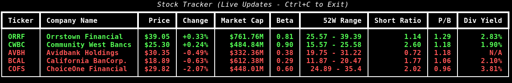

# Thunderfoots Stock Tracker

A real-time command-line interface (CLI) stock tracking tool built with Python. It provides a live, auto-refreshing dashboard for monitoring a specific portfolio of banking sector stocks, displaying key financial metrics and performance indicators.



## Features

*   **Live Updates:** auto-refreshes stock data every 30 seconds.
*   **Rich UI:** Uses the `rich` library for a beautiful, formatted terminal table.
*   **Key Performance Indicators (KPIs):**
    *   **Price & Change:** Current market price and percentage change.
    *   **Market Cap:** Formatted market capitalization.
    *   **Risk Metrics:** Beta (volatility) and Short Ratio.
    *   **Valuation:** Price-to-Book (P/B) ratio.
    *   **Income:** Dividend Yield.
    *   **Range:** 52-Week High/Low range.
*   **Error Handling:** gracefully handles network issues or missing data points (displaying "N/A").

## Tracked Stocks

Currently configured to track:
*   **ORRF:** Orrstown Financial
*   **COFS:** ChoiceOne Financial
*   **CWBC:** Community West Bancs
*   **AVBH:** Avidbank Holdings
*   **BCAL:** California BanCorp.

## Prerequisites

*   Python 3.6 or higher
*   Internet connection (for fetching data from Yahoo Finance)

## Installation

1.  **Clone the repository** (or download the files):
    ```bash
    git clone <repository-url>
    cd fourthstone
    ```

2.  **Create a virtual environment** (recommended):
    ```bash
    python3 -m venv venv
    source venv/bin/activate  # On Windows: venv\Scripts\activate
    ```

3.  **Install dependencies:**
    ```bash
    pip install -r requirements.txt
    ```

## Usage

Run the tracker script:

```bash
python tracker.py
```

The application will launch in your terminal and update automatically. To exit, press `Ctrl+C`.

## Customization

To modify the list of tracked stocks, edit the `STOCKS` dictionary in `tracker.py`:

```python
STOCKS = {
    "TICKER": "Company Name",
    ...
}
```
